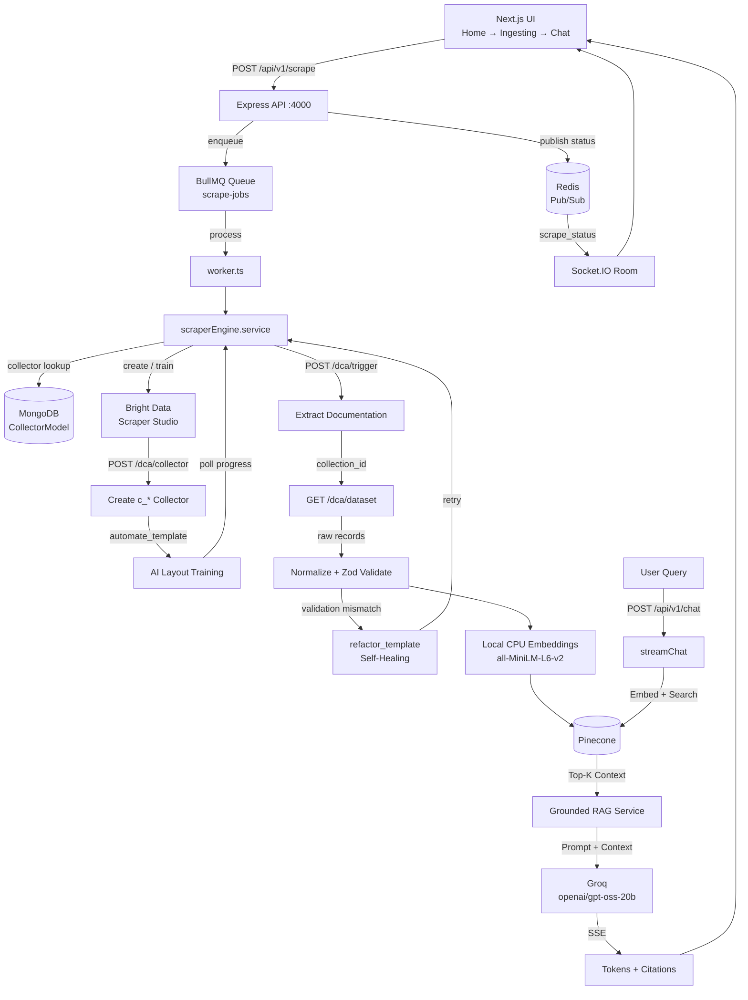

# Live-Docs

### Understand any documentation, instantly.

**Self-Healing Web Scraping + AI Vector Search** — paste any API docs, developer guide, or engineering manual URL, and Docs→RAG turns it into a live, queryable knowledge base with grounded, source-cited answers.

Docs→RAG solves a real pain point for engineering teams: static docs are hard to search, harder to navigate, and frequently reorganize their layouts. Instead of writing and maintaining brittle CSS/XPath parsers, Docs→RAG uses **Bright Data Scraper Studio** to auto-generate adaptive AI extraction templates (`c_*` collectors), automatically **self-heals when a site changes its markup**, and pipes the structured output into a free, local embedding pipeline → Pinecone vector store → a **Groq-powered grounded chat UI with strict source citations**.

Built for the **Into the Scrape-Verse Hackathon** by **WeMakeDevs & Bright Data** — Hackathon Edition v1.0.

[](https://brightdata.com/)
[](https://wemakedevs.org/)
[](https://nodejs.org/)
[](https://www.typescriptlang.org/)
[](https://nextjs.org/)
[](https://react.dev/)
[](https://expressjs.com/)
[](https://tailwindcss.com/)
[](https://www.pinecone.io/)
[](https://groq.com/)
[](https://redis.io/)
[](https://bullmq.io/)
[](https://socket.io/)
[](https://zod.dev/)
[](#license)

**Self-Healing Web Scraping + AI Vector Search**

Paste any API documentation, developer guide, or engineering manual URL, and **Live-Docs** turns it into an interactive, queryable knowledge base with grounded, source-cited answers.

Live-Docs addresses a common engineering problem: documentation is fragmented, difficult to navigate, and frequently changes its page structure. Instead of maintaining brittle CSS/XPath parsers, Live-Docs uses **Bright Data Scraper Studio** to automatically create adaptive AI extraction templates (`c_*` collectors), detect extraction failures, self-heal when layouts change, and feed normalized content into a RAG pipeline:

**Documentation → Bright Data Scraper Studio → Validation → Local Embeddings → Pinecone → Groq → Streaming Answers + Citations**

> Built for the **Into the Scrape-Verse Hackathon** by **WeMakeDevs & Bright Data** — Hackathon Edition v1.0.

---

## ✨ Why Live-Docs?

Traditional documentation search breaks down when:

- documentation is spread across many pages;
- page layouts change without warning;
- custom scrapers become expensive to maintain;
- search returns text without enough context;
- AI answers are difficult to verify.

Live-Docs replaces that brittle workflow with an automated pipeline that can **discover, extract, validate, heal, index, retrieve, and cite** documentation.

---

## 🚀 Key Features

### ✨ Zero Manual Parsers

Submit a documentation URL and Bright Data **Scraper Studio** automatically creates and trains a custom `c_*` collector.

The extraction pipeline produces structured fields such as:

- `title`
- `content` — normalized Markdown
- `headings`
- `code_blocks`

No hand-written XPath/CSS selectors are required.

### 🛡️ Self-Healing Extraction

Every extracted dataset passes through a **Zod validation gate**.

If the target site's layout changes and the extracted structure no longer matches the expected schema:

1. validation detects the mismatch;
2. Live-Docs requests a Bright Data template refactor;
3. the AI extraction template is retrained;
4. the system waits for the healed template;
5. extraction is retried automatically.

This prevents documentation ingestion from silently becoming stale when a website changes its markup.

### ⚙️ Resilient Background Jobs

Scraping is asynchronous:

- requests enter the **BullMQ `scrape-jobs` queue**;
- Redis backs queue processing and pub/sub;
- a dedicated worker performs extraction;
- status events are published through Redis;
- Socket.IO delivers live status updates to the correct browser room.

The frontend can therefore show ingestion progress without blocking the API request.

### 🧠 Local Embeddings

Live-Docs generates 384-dimensional embeddings locally using:

`Xenova/all-MiniLM-L6-v2`

via `@huggingface/transformers`.

The embedding step runs on CPU and avoids a separate hosted embedding API.

Documents are chunked before indexing, using approximately:

- **Chunk size:** `1000`
- **Overlap:** `150`

### 💬 Grounded AI Chat

Retrieved documentation context is sent to **Groq** using:

`openai/gpt-oss-20b`

The RAG pipeline retrieves up to **10 relevant chunks** from Pinecone, applies the relevant `roomId + domain + hasLinks` filtering, and injects the context into a grounded system prompt.

Responses are streamed token-by-token using **Server-Sent Events (SSE)**.

Every answer can point back to the exact documentation page that supports it.

### 🌐 Developer-Focused UI

The Next.js interface follows a simple three-state flow:

`Home → Ingesting → Chat`

The ingestion experience includes live progress updates, while the chat interface provides:

- indexed-page navigation;
- streamed responses;
- source/citation chips;
- code blocks;
- re-indexing controls.

### 🔐 Production-Hardened API

The Express API includes:

- Helmet;
- CORS;
- global rate limiting;
- scrape-specific rate limiting;
- chat-specific rate limiting;
- graceful shutdown;
- `/health` monitoring;
- persistent job and collector metadata.

### 🧾 Structured Data Normalization

Bright Data responses can expose fields in different shapes. Live-Docs normalizes these variants into a consistent `ScrapedDoc` representation before validation and indexing.

Core fields include:

```ts
{
  url,
  title,
  content,
  headings,
  codeBlocks,
  scrapedAt
}
```

### 🐳 Dockerized Backend

The backend includes a multi-stage `node:22-slim` Docker build:

`builder → TypeScript compilation → production dependency pruning → lightweight runner`

---

## 🏗️ Architecture



---

## 🔄 End-to-End Data Flow

### 1. Documentation URL

The user submits a documentation URL from the frontend.

### 2. Job Creation

The Express API validates the request and places a scraping job into the BullMQ `scrape-jobs` queue.

### 3. Collector Reuse or Creation

The worker checks MongoDB for an existing collector associated with the documentation domain.

If a ready collector exists, Live-Docs reuses it.

Otherwise, it creates and trains a new Bright Data `c_*` collector.

### 4. AI Template Training

Bright Data Scraper Studio is instructed to extract:

- page title;
- Markdown content;
- headings;
- code blocks.

Training progress is polled until the template becomes ready.

### 5. Extraction

Live-Docs triggers the collector against the supplied documentation URL and receives a `collection_id`.

The dataset endpoint is then polled until the extraction completes.

HTTP `202` and intermediate collection states are treated as asynchronous processing rather than immediate failure.

### 6. Validation

The raw result is normalized and validated against the application's Zod schema.

### 7. Self-Healing

If validation fails because the page structure changed, Live-Docs invokes Bright Data's:

`POST /dca/collectors/:id/refactor_template`

The refactor process is monitored and the extraction is retried.

### 8. Embedding & Indexing

Validated content is chunked and embedded locally using `all-MiniLM-L6-v2`.

Vectors and metadata are stored in Pinecone.

### 9. Live Status

Scraping status is published through Redis and forwarded to the frontend using Socket.IO room scoping.

### 10. RAG Chat

A user query is embedded, relevant vectors are retrieved from Pinecone, and the retrieved context is passed to Groq.

### 11. Streaming Answer

Groq streams the grounded response through SSE, while the UI renders tokens and source citations as they arrive.

---

## 🔌 Bright Data Scraper Studio Integration

| Phase | API / Mechanism | Purpose |
|---|---|---|
| **Collector creation** | `POST /dca/collector` | Creates a domain-specific `c_*` collector in `api_pull` mode. |
| **AI layout training** | `POST /dca/collectors/:id/automate_template` | Trains an extraction template for title, Markdown content, headings, and code blocks. |
| **Training verification** | `GET /dca/collectors/:id/progress` | Polls until the AI-generated template is ready. |
| **Trigger extraction** | `POST /dca/trigger` | Starts extraction for the requested documentation URL. |
| **Dataset retrieval** | `GET /dca/dataset?id=<collection_id>` | Polls the generated dataset until processing is complete. |
| **Validation gate** | Zod + normalization | Ensures Bright Data output matches the application's `ScrapedDoc` schema. |
| **Self-healing** | `POST /dca/collectors/:id/refactor_template` | Retrains the collector when validation detects a layout mismatch. |

### Collector Reuse

Collector metadata is persisted in MongoDB through `CollectorModel`.

That means subsequent ingestion requests for the same domain can reuse a ready collector instead of paying the template-generation overhead again.

---

## 🧰 Tech Stack

| Layer | Technology |
|---|---|
| **Frontend** | Next.js 16, React 19, TypeScript, Tailwind CSS 4, Socket.IO Client, Lucide |
| **Backend** | Node.js 22, Express 5, TypeScript, Zod 4, Helmet, CORS |
| **Job Orchestration** | BullMQ 6, Redis 7, ioredis |
| **Realtime** | Socket.IO 4, Redis Pub/Sub |
| **Scraping** | Bright Data Scraper Studio / DCA |
| **Embeddings** | `@huggingface/transformers`, `Xenova/all-MiniLM-L6-v2` |
| **Vector Database** | Pinecone |
| **LLM** | Groq — `openai/gpt-oss-20b` |
| **RAG** | LangChain, local embeddings, Pinecone retrieval |
| **Database** | MongoDB, Mongoose |
| **Validation** | Zod 4 |
| **Deployment** | Docker, multi-stage `node:22-slim` backend |

---

## 📁 Project Structure

```text
Live-Docs/
├── README.md
├── server/                              # Express API, Bright Data & RAG engine
│   ├── Dockerfile
│   ├── .dockerignore
│   ├── .env.example
│   ├── package.json
│   ├── tsconfig.json
│   └── src/
│       ├── app.ts                       # Server entry point & Socket.IO setup
│       ├── routes/
│       │   ├── index.ts
│       │   ├── scrape.routes.ts         # Scrape API
│       │   └── chat.routes.ts           # SSE chat API
│       ├── controllers/
│       │   ├── scrape.controller.ts     # Queue creation & status publishing
│       │   └── chat.controller.ts       # Retrieval & streaming
│       ├── services/
│       │   ├── brightData.service.ts    # Bright Data API wrapper
│       │   ├── scraperEngine.service.ts # Collector + self-healing orchestration
│       │   ├── scrape.service.ts        # Scrape job state machine
│       │   ├── rag.service.ts           # Embeddings & Pinecone sync
│       │   └── chat.service.ts          # Retrieval & Groq client
│       ├── workers/
│       │   └── worker.ts                # BullMQ background worker
│       ├── config/
│       │   ├── brightdata.config.ts
│       │   ├── mongose.db.ts
│       │   ├── queue.config.ts
│       │   ├── redis.config.ts
│       │   └── socket.config.ts
│       ├── model/
│       │   ├── collector.model.ts
│       │   └── scraper.model.ts
│       ├── schemas/
│       │   └── docSchema.ts
│       ├── repositories/
│       │   └── json.db.ts
│       ├── middleware/
│       │   └── rate.limiter.ts
│       ├── types/
│       │   └── index.ts
│       ├── utils/
│       │   ├── isAlive.ts
│       │   ├── tryCatch.ts
│       │   ├── validateResult.ts
│       │   └── gracefulShutdown.ts
│       └── tests/
│           └── test.stream.ts
│
└── frontend/                            # Next.js client
    ├── package.json
    ├── tsconfig.json
    ├── postcss.config.mjs
    ├── app/
    │   ├── layout.tsx
    │   ├── page.tsx
    │   └── globals.css
    ├── components/
    │   ├── Navbar.tsx
    │   ├── HeroView.tsx
    │   ├── IngestionModal.tsx
    │   ├── ChatView.tsx
    │   └── Footer.tsx
    ├── context/
        └── socketContext.tsx
        
   
```

> **Repository note:** Some names in the current repository reflect legacy prototypes. For example, `repositories/json.db.ts` is backed by Mongoose rather than a JSON file, while the legacy `exmapp.ts` contains the earlier file-based prototype.

---

## ⚙️ Prerequisites

Before running Live-Docs locally, make sure you have:

- **Node.js:** `22+` recommended
- **npm:** included with Node.js
- **Redis:** `7+`
- **MongoDB:** `4.4+`
- **Docker:** optional, but recommended for local Redis/MongoDB
- **Bright Data API key**
- **Pinecone API key**
- **Groq API key**

---

## 🔐 Environment Variables

Create `server/.env` from the provided example:

```bash
cd server
cp .env.example .env
```

Then configure:

| Variable | Description | Default |
|---|---|---|
| `BRIGHTDATA_API_KEY` | Bright Data API key | — |
| `PINECONE_API_KEY` | Pinecone API key | — |
| `PINECONE_INDEX_NAME` | Pinecone index name | `docs-rag` |
| `GROQ_API_KEY` | Groq API key | — |
| `REDIS_URL` | Redis connection URL | `redis://localhost:6379` |
| `MONGO_URI` | MongoDB connection string | `mongodb://localhost:27017/live-docs` |
| `PORT` | API port | `4000` |
| `NEXT_PUBLIC_SOCKET_URL` | Socket.IO server URL | `http://localhost:4000` |

> **Security:** Never commit real API keys or `.env` files. Use placeholders in `.env.example`. If a credential has ever been exposed, rotate it.

---

## 📦 Quickstart

### 1. Clone the repository

```bash
git clone https://github.com/imshubhamgiri/Live-Docs.git
cd Live-Docs
```

### 2. Start Redis & MongoDB

Using Docker:

```bash
docker run -d --name live-docs-redis -p 6379:6379 redis:7-alpine

docker run -d --name live-docs-mongo -p 27017:27017 mongo:7
```

### 3. Configure the backend

```bash
cd server
cp .env.example .env
```

Add your Bright Data, Pinecone, and Groq credentials.

### 4. Install dependencies

```bash
# Backend
cd server
npm ci

# Frontend
cd ../frontend
npm ci
```

### 5. Start the development services

Open three terminals.

**Terminal 1 — API + WebSockets**

```bash
cd server
npm run dev
```

**Terminal 2 — BullMQ worker**

```bash
cd server
npm run worker
```

**Terminal 3 — Next.js frontend**

```bash
cd frontend
npm run dev
```

Open:

**http://localhost:3000**

---

## 🐳 Production / Docker

Build the backend image:

```bash
cd server
docker build -t live-docs-server .
```

The Dockerfile uses a multi-stage `node:22-slim` build to compile TypeScript and produce a production-oriented runtime image.

For the frontend:

```bash
cd frontend
npm run build
npm run start
```

---

## 🧪 Testing & Verification

### 1. Health Check

```bash
curl http://localhost:4000/health
```

Expected response resembles:

```json
{
  "status": "ok",
  "uptime": 0.5,
  "timestamp": "...",
  "database": "connected"
}
```

### 2. Queue a Scrape

```bash
curl -X POST http://localhost:4000/api/v1/scrape \
  -H "Content-Type: application/json" \
  -d '{"url":"https://docs.brightdata.com/scraper-studio","roomId":"test-room"}'
```

The API returns a `jobId`.

### 3. Inspect Job Status

```bash
curl http://localhost:4000/api/v1/scrape/job/<jobId>
```

Typical states include:

```text
queued
processing
training_ai_layout
extracting_data
completed
failed
```

### 4. Test Streaming Chat

```bash
curl -N -X POST http://localhost:4000/api/v1/chat \
  -H "Content-Type: application/json" \
  -d '{
    "query": "How do I trigger an extraction in Scraper Studio?",
    "domain": "docs.brightdata.com",
    "roomId": "test-room",
    "conversationHistory": []
  }'
```

### 5. Run the Vector Retrieval Sanity Check

```bash
cd server
npx tsx src/tests/test.stream.ts
```

### 6. Verify Through the UI

Open:

```text
http://localhost:3000
```

Paste a documentation URL and follow the ingestion flow:

```text
Home
  ↓
Ingesting
  ↓
Bright Data extraction
  ↓
Validation
  ↓
Self-healing (if required)
  ↓
Embedding
  ↓
Pinecone indexing
  ↓
Chat
```

---

## 🛡️ Reliability & Failure Handling

Live-Docs is designed around the assumption that external documentation and external APIs can fail.

### Documentation layout changes

**Problem:** The site's DOM structure changes.

**Response:** Zod validation detects the mismatch → Bright Data refactor is requested → template is retrained → extraction is retried.

### Dataset still processing

**Problem:** Bright Data returns an intermediate state or HTTP `202`.

**Response:** The worker treats the response as asynchronous processing and continues polling.

### Scraping takes time

**Problem:** Collector training and extraction are not instant operations.

**Response:** Scraping runs in BullMQ rather than inside the HTTP request lifecycle, while Socket.IO reports progress to the client.

### Existing domain

**Problem:** Re-training a collector for every URL is wasteful.

**Response:** `CollectorModel` persists domain-to-collector mappings so ready collectors can be reused.

### Graceful shutdown

The backend coordinates shutdown across:

```text
Socket.IO
   ↓
BullMQ
   ↓
HTTP server
   ↓
MongoDB
   ↓
Redis
```

This reduces the chance of leaving active jobs or connections in an inconsistent state.

---

## 🔗 API Overview

| Method | Endpoint | Purpose |
|---|---|---|
| `GET` | `/health` | API + database health |
| `POST` | `/api/v1/scrape` | Queue a documentation ingestion job |
| `GET` | `/api/v1/scrape/job/:id` | Inspect a scrape job |
| `POST` | `/api/v1/chat` | Stream a grounded RAG response via SSE |

### Scrape Request

```json
{
  "url": "https://docs.example.com",
  "roomId": "room-id"
}
```

### Chat Request

```json
{
  "query": "How does authentication work?",
  "domain": "docs.example.com",
  "roomId": "room-id",
  "conversationHistory": []
}
```

---

## 🎯 Design Principles

Live-Docs is built around a few core engineering principles:

- **Automate instead of maintaining brittle parsers.**
- **Validate external data before indexing it.**
- **Heal extraction failures instead of silently accepting bad data.**
- **Move long-running work to background workers.**
- **Keep embeddings local where practical.**
- **Ground LLM responses in retrieved documentation.**
- **Return citations so generated answers remain verifiable.**
- **Reuse trained collectors to reduce unnecessary work.**
- **Stream progress and answers instead of making the UI wait blindly.**

---

## 👥 Team & Acknowledgments

Built for the **Into the Scrape-Verse Hackathon** hosted by:

- [WeMakeDevs](https://wemakedevs.org/)
- [Bright Data](https://brightdata.com/)

### Focus Area

The project focuses on Bright Data **Scraper Studio**, particularly:

- `c_*` collectors;
- automated AI layout learning;
- self-healing extraction;
- structured downstream data;
- integration with a grounded RAG workflow.

Repository:

https://github.com/imshubhamgiri/Live-Docs

> **Built for the win.** 💥

---

## 📜 License

This project is licensed under the **ISC License**.

See the repository's license files and package manifests for the definitive licensing information of individual components.

---

<div align="center">

**Live-Docs — Documentation that heals itself.**

</div>
